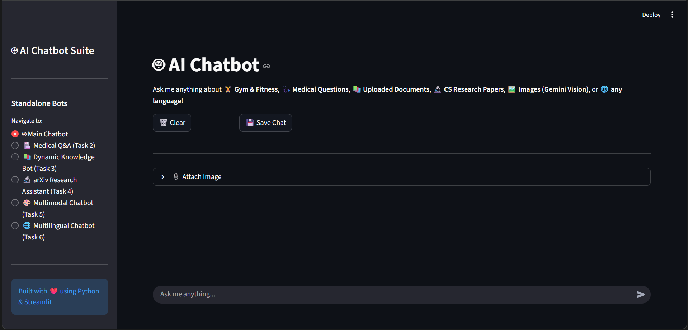
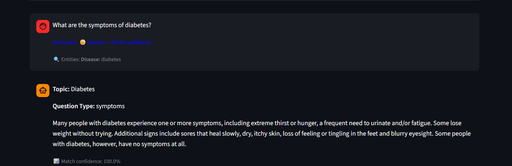
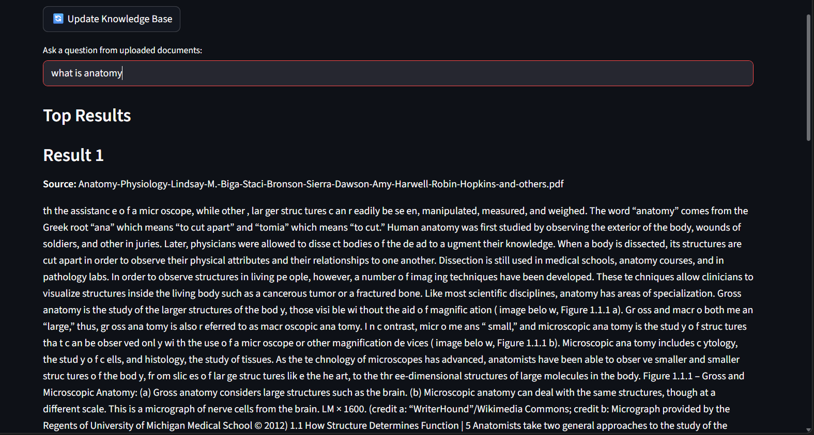
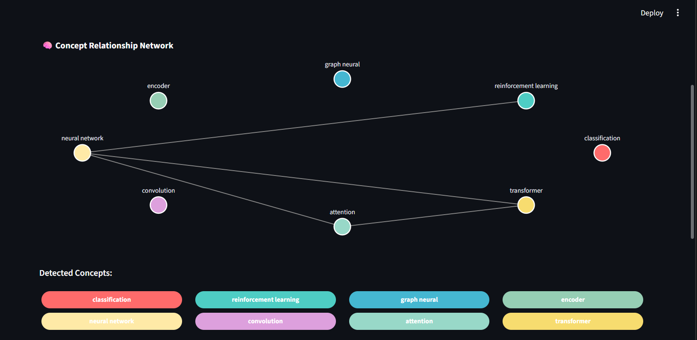
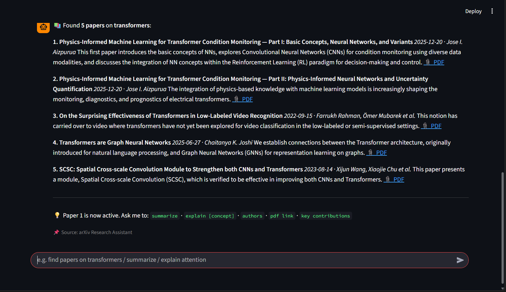
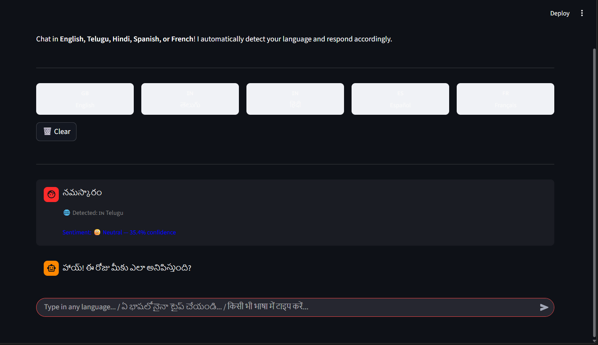
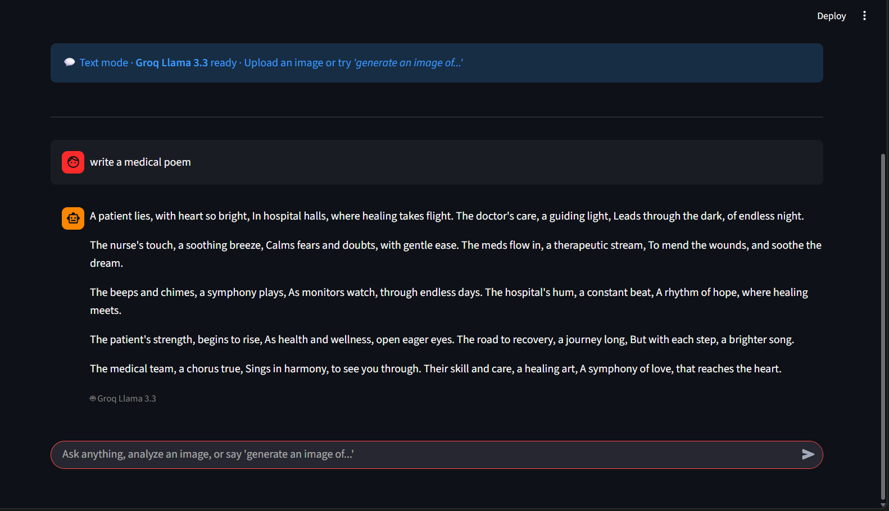
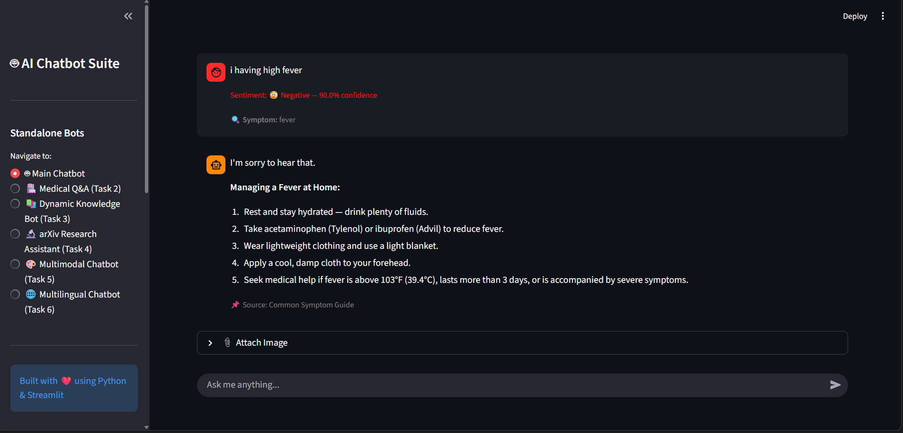

# Advanced Multi-Feature NLP Chatbot

## Project Overview

This project is an advanced NLP chatbot developed using Python and Streamlit.

### Features

- Sentiment Analysis
- Medical Q&A using MedQuAD
- Dynamic Knowledge Base Expansion
- arXiv Expert Chatbot
- Multimodal Chatbot
- Multilingual Support

## Technologies Used

- Python
- Streamlit
- Scikit-Learn
- FAISS
- Sentence Transformers
- Google Gemini API
- LangDetect
- Plotly
## Screenshots

### Home Page


### Sentiment Analysis


### Medical Q&A


### Dynamic Knowledge Base


### arXiv Expert Chatbot


### arXiv Concept Explanation


### Multilingual Chatbot


### Multimodal Chatbot


### Final Output



## Setup Instructions

### 1. Clone the Repository

```bash
git clone https://github.com/DileepRajesh-2006/NLP-MultiFeature-Chatbot.git
```

### 2. Navigate to the Project Folder

```bash
cd NLP-MultiFeature-Chatbot
```

### 3. Install Dependencies

```bash
pip install -r requirements.txt
```

### 4. Download Datasets

Download the required datasets from the Google Drive link provided in the project documentation.

### 5. Configure API Keys

Create a `.env` file and add:

```env
GOOGLE_API_KEY=your_gemini_api_key
GROQ_API_KEY=your_groq_api_key
```

### 6. Run the Application

```bash
streamlit run app.py
```

## Author
## Documentation

📄 **Project Report:** [Project_Report.pdf](Project_Report.pdf)

The detailed project report contains:
- Project architecture
- Implementation details
- Features and modules
- Challenges and solutions
- Performance metrics
- Future enhancements

Dileep Rajesh  
B.Tech CSE  
ANITS